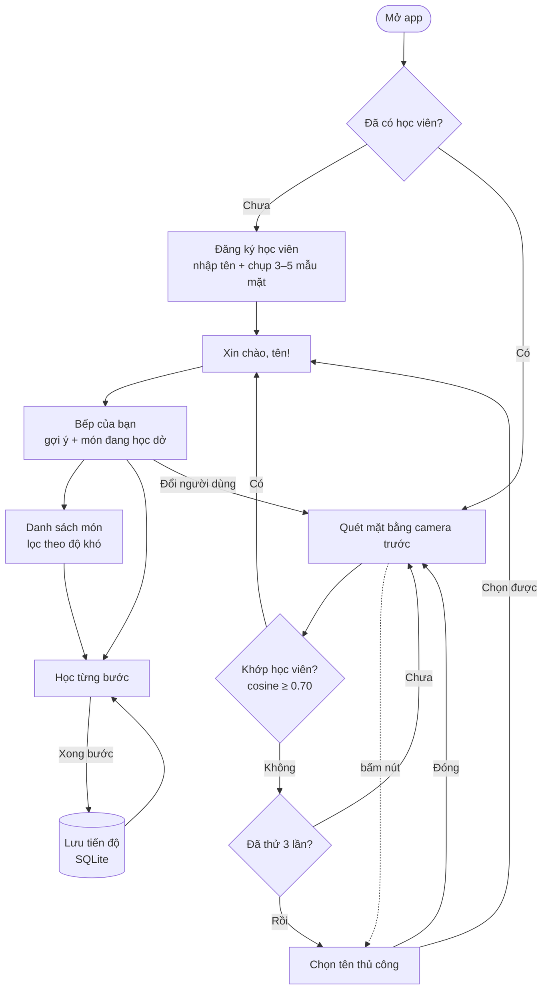

# Be A Chef

Ứng dụng Android học nấu ăn, nhận diện khuôn mặt học viên ngay trên máy để mở đúng lộ trình bài học của từng người.

## Vấn đề giải quyết

Một chiếc điện thoại/máy tính bảng đặt trong bếp thường được nhiều người dùng chung (gia đình, lớp học nấu ăn).
Mỗi người học tới một món, một bước khác nhau, nhưng không ai muốn gõ tài khoản – mật khẩu khi tay đang dính bột.
Be A Chef nhận ra ai đang đứng trước máy chỉ bằng camera trước, rồi mở đúng món đang học dở và gợi ý món tiếp theo
phù hợp trình độ. Mọi xử lý diễn ra **offline trên máy**, ảnh khuôn mặt không được gửi đi đâu.

## App làm được gì

- **Quét mặt khi mở app**: nhận diện học viên đã đăng ký → chào "Xin chào, *tên*!" → vào trang riêng.
  Thử tối đa 3 lần; thất bại thì chuyển sang **chọn tên thủ công**.
- **Đăng ký học viên**: nhập tên, app tự chụp 3–5 mẫu mặt (chỉ nhận khung hình có đúng 1 mặt, đủ lớn, nhìn thẳng).
- **Trang "Bếp của bạn"**: gợi ý món tiếp theo kèm lý do, danh sách món đang học dở, nút đổi người dùng.
- **Gợi ý theo luật**: ưu tiên món đang dở → món cùng độ khó đã đạt → khó hơn một bậc → người mới bắt đầu từ món dễ nhất.
- **Danh sách 10 món** (độ khó 1–3), lọc theo độ khó, hiện trạng thái học của từng món.
- **Học từng bước**: xem nguyên liệu, làm lần lượt từng bước; tiến độ lưu riêng cho mỗi học viên (SQLite trên máy).

## Ảnh chụp màn hình

> Ảnh sẽ được bổ sung vào thư mục [`docs/screenshots/`](docs/screenshots/).

| Quét mặt | Đăng ký | Bếp của bạn | Danh sách món | Học từng bước |
|---|---|---|---|---|
|  |  |  |  |  |

## Tải APK

Tải file `app-release.apk` mới nhất tại trang **[Releases](../../releases)** của repo.

Yêu cầu: Android **8.0 (API 26)** trở lên, có camera trước.

## Cài đặt APK

1. Tải file `.apk` từ trang Releases về điện thoại.
2. Mở file vừa tải. Nếu Android chặn, bấm **Cài đặt** → bật **"Cho phép từ nguồn này"**
   (tên có thể là *"Cài đặt ứng dụng không xác định"* / *"Nguồn không xác định"* tùy hãng) cho trình duyệt hoặc
   trình quản lý file bạn đang dùng.
3. Quay lại, bấm **Cài đặt**. Nếu Google Play Protect cảnh báo, chọn **Vẫn cài đặt**.
4. Mở app **Be A Chef**, cho phép quyền **Camera** khi được hỏi.

## Cách dùng

1. **Lần đầu mở app**: chưa có học viên → bấm **Đăng ký học viên**.
2. Nhập tên, giữ điện thoại ngang mặt, nhìn thẳng vào camera trước. App tự chụp mẫu; đủ 3 mẫu thì bấm **Lưu**
   (bấm **Chụp lại** nếu muốn làm lại).
3. **Những lần sau**: mở app, nhìn thẳng vào camera → app chào tên bạn và vào trang **Bếp của bạn**.
   Nếu không nhận ra, bấm **Chọn thủ công** để chọn tên, hoặc **Đăng ký mới**.
4. Ở **Bếp của bạn**: bấm vào món gợi ý hoặc món đang học dở để học tiếp; bấm **Xem tất cả món** để xem và lọc theo độ khó.
5. Trong màn học: đọc nguyên liệu, làm từng bước rồi bấm **Xong bước này**. Thoát giữa chừng không sao,
   lần sau mở lại app sẽ nhảy tới đúng bước đang dừng.
6. Máy dùng chung: bấm biểu tượng **Đổi người dùng** trên thanh tiêu đề để quét mặt người khác.

## Sơ đồ luồng

Bên trong một lần quét: **ML Kit** tìm khuôn mặt → cắt và chuẩn hóa ảnh mặt → **MobileFaceNet (TFLite)** tạo vector
đặc trưng → so độ giống cosine với vector trung bình của từng học viên đã lưu trong SQLite.

## Công nghệ

- **Flutter 3.47.4 / Dart 3.13.3**, Material 3, target chính Android.
- Nhận diện hoàn toàn offline: ML Kit Face Detection (phát hiện mặt) + MobileFaceNet chạy bằng TensorFlow Lite (so khớp mặt).
- Lưu trữ cục bộ bằng SQLite; dữ liệu bài học đóng gói trong `assets/data/lessons.json`.

| Package | Phiên bản | License | Mục đích |
|---|---|---|---|
| [camera](https://pub.dev/packages/camera) | 0.12.1 | BSD-3-Clause | Luồng hình ảnh từ camera trước |
| [google_mlkit_face_detection](https://pub.dev/packages/google_mlkit_face_detection) | 0.15.1 | MIT | Phát hiện khuôn mặt, góc đầu, xác suất mở mắt |
| [tflite_flutter](https://pub.dev/packages/tflite_flutter) | 0.12.1 | Apache-2.0 | Chạy model MobileFaceNet để tạo vector khuôn mặt |
| [image](https://pub.dev/packages/image) | 4.10.1 | MIT | Chuyển đổi YUV/NV21 → RGB, xoay, cắt ảnh mặt |
| [sqflite](https://pub.dev/packages/sqflite) | 2.4.4 | BSD-2-Clause | CSDL SQLite: học viên, vector mặt, tiến độ học |
| [path](https://pub.dev/packages/path) | 1.9.1 | BSD-3-Clause | Ghép đường dẫn file database |
| [permission_handler](https://pub.dev/packages/permission_handler) | 13.0.2 | MIT | Xin quyền camera lúc chạy |

Phiên bản ở trên là bản đã khóa trong `pubspec.lock`.

## Model nhận diện

- **MobileFaceNet** (`assets/models/mobilefacenet.tflite`, ~5 MB), lấy từ dự án
  [MCarlomagno/FaceRecognitionAuth](https://github.com/MCarlomagno/FaceRecognitionAuth).
- License: **BSD 3-Clause**, Copyright (c) 2020 Marcos Carlomagno. Toàn văn trong
  [`assets/models/LICENSE-mobilefacenet.txt`](assets/models/LICENSE-mobilefacenet.txt).
- Tiền xử lý theo mã nguồn gốc: pixel chuẩn hóa `(giá trị − 128) / 128`. Ngưỡng khớp và các tham số khác nằm trong
  [`lib/core/config.dart`](lib/core/config.dart).

## Hạn chế đã biết

- **Chưa chống ảnh giả**: logic nháy mắt (`lib/services/liveness_service.dart`) đã viết và có test nhưng chưa gắn vào
  màn quét, nên đưa ảnh/video khuôn mặt của học viên vào camera vẫn có thể được nhận diện. Không dùng app cho mục đích bảo mật.
- Ngưỡng cosine `0.70` được chọn qua thử nghiệm trên ít người; ánh sáng yếu, đeo khẩu trang/kính râm, hoặc người có
  khuôn mặt giống nhau (anh chị em) có thể nhận nhầm hoặc không nhận ra → dùng **Chọn thủ công**.
- Chỉ hỗ trợ **màn hình dọc**, cần **camera trước** và Android **8.0+** (do `tflite_flutter` yêu cầu API 26).
- Trên **máy ảo Android**, camera trước thường là hình giả lập hoặc màn đen → không nhận diện được; nên thử trên máy thật.
- Chỉ có 10 món cố định trong `lessons.json`, chưa có màn thêm/sửa món; chưa có màn xóa/sửa học viên.
- Dữ liệu chỉ nằm trên máy: gỡ app hoặc xóa dữ liệu app là mất học viên và tiến độ; không có sao lưu/đồng bộ.
- Chưa build và kiểm thử cho iOS.

## Nhóm phát triển

| Họ tên | Email | Vai trò |
|---|---|---|
| Bui Nhut Phi | `<email>` | Trưởng nhóm, phát triển chính, build & release |
| Nguyen Hoai Phong | `<email>` | Kiểm thử nhận diện, đề xuất ngưỡng |
| Huynh Quang Tuan | `<email>` | Nội dung bài học, góp ý UI |
| Nguyen Thanh Danh | `<email>` | Tài liệu, kiểm tra hướng dẫn cài đặt, demo |

Muốn tự build hoặc đóng góp: xem [CONTRIBUTING.md](CONTRIBUTING.md).

## License

Phát hành theo giấy phép [MIT](LICENSE). Model MobileFaceNet và các package bên thứ ba giữ license riêng như liệt kê ở trên.
